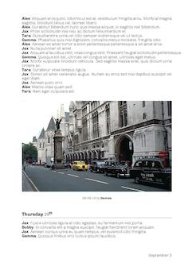

# WhatsBook | WhatsApp chat parser for print using LaTeX

Archiving of your WhatsApp conversations in printed form seemed like a beautiful idea. I first came across it in a blog post by [Pelle Beckman](https://medium.com/@pbeck/whatsapp-books-a-hacker-s-guide-edbb397e0bee), the code below is my take on this beautiful idea.


WhatsApp has a little know feature that allows one to export a certain chat to a parsable format. After extracting the resulting export has a single `_chat.txt` file that contains the entire chat conversation. Additionally the different attachments are present with a simple time stamp and numerical index.

```sh
chatExport.zip
  |--  _chat.txt
  |--  2017-04-13-PHOTO-00000001.jpg
  |--  2017-04-13-PHOTO-00000002.jpg
  |--  2017-04-13-AUDIO-00000003.aac
  |--  2017-04-13-AUDIO-00000004.opus
  |--  2017-04-13-VIDEO-00000005.mp4
```

## Usage

To use the `WhatsBook.py` simply clone the repository and drag the extracted WhatsApp export to the main folder. One can than run the script as a simple one liner given below or without any arguments to start the guided set-up.

```sh
git clone https://github.com/theveloped/WhatsBook.git
cd WhatsBook
python whatsBook.py exportDirectory > content.tex
```

I than used `pdfLaTeX` to render the output to pdf. If the output of the script was named `content.tex` as indicated above, one should be able to build `whatsBook.tex` without any changes.

## Test

There is a tiny example chat to generate the test file that is indicated in the images. Running the script with the `-c` flag will create the wordclouds for the chapter pages (note this is a expensive process and I thus advise you to run in without while testing on large chats).

```sh
git clone https://github.com/theveloped/WhatsBook.git
cd WhatsBook
python whatsBook.py tets > content.tex
```

After building using `pdfLaTeX` the resulting pages should look like this:

  

## License

This script is released under MIT License.
